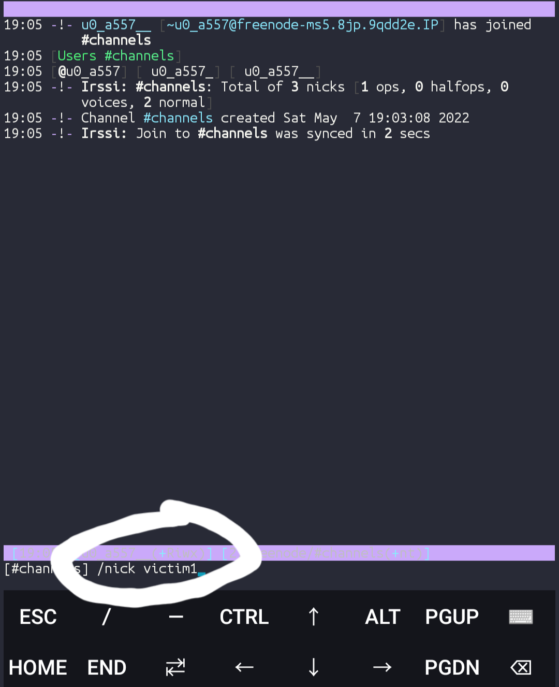

## how to set up:

[+] step 1 ⬇️ install `termux apk`  

                           

[+] step 2 after installation process. type the following commands.  

[+] `pkg install irssi`.  

[+] after irssi tool installed Run it by `irssi` 
 

[+] after you successfully run then connect to the server .  

[+] `/connect freenode`.  
**note:**
- there are many server but for chat it's best
- server's like  `liberchat`.  
[+] after connected look like this 

 

[+] after connected join the channel or create a channels by

[+] `/join 'your channels name'`

[+] after you joined it look like this 
 
 

[+] then tell you `friend to doo the same step`..  

[+] And join the channel you created.  

[+] change your name by 

[+] `/nick yourname `

    

[+] after you and your friends joind the channel.  
[+] You can chat `Anonymously and no one can see you chats`

### example:
 

### extra command:
- `SERVER CONNECT`
- `SERVER REMOVE`
- `disconnect`
-  `ADD NETWORK` 
 

### Find Me on :

